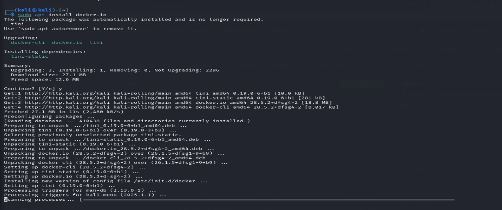
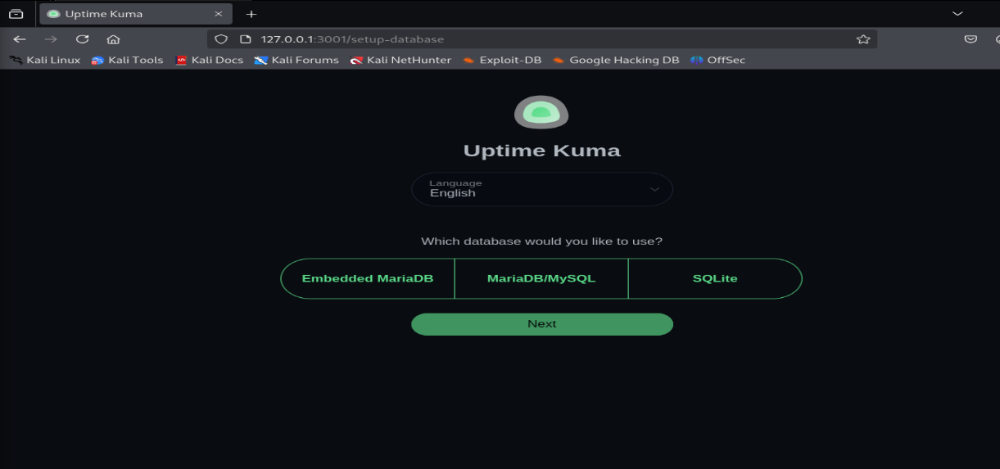
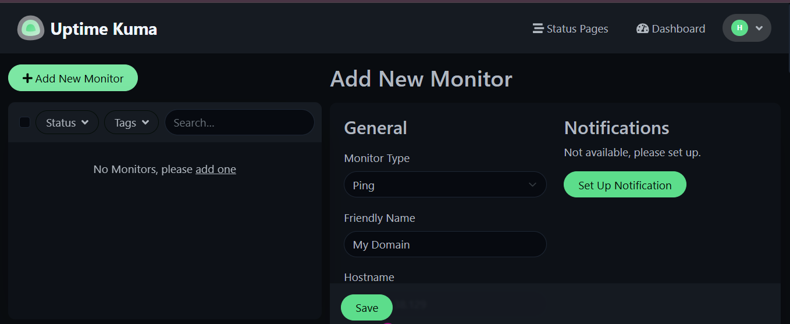
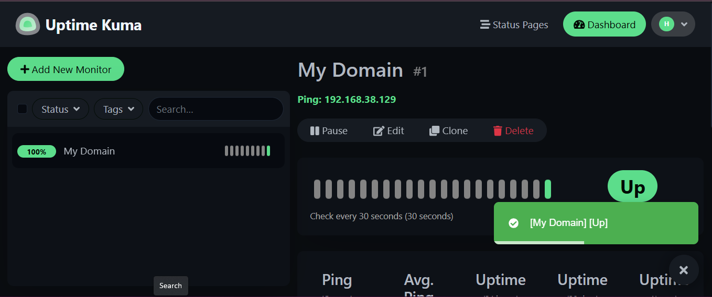
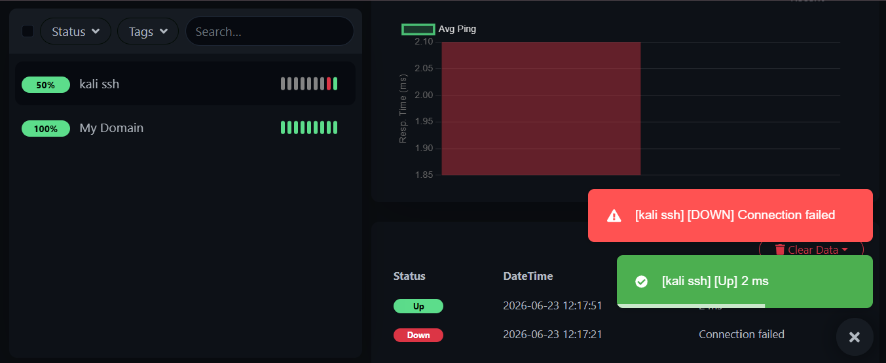
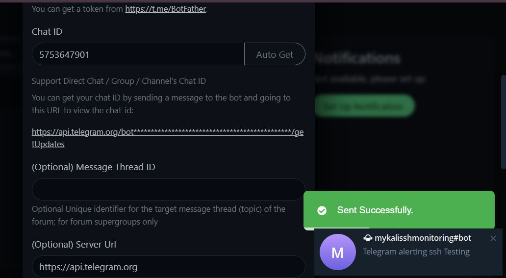

# UPTIME-KUMA-NETWORK-MONITORING-LAB

In this lab, I deployed Uptime Kuma on a Linux operating system using Docker and configured it to monitor the availability of network devices and services. I also configured notifications to receive alerts whenever the monitored services changed status.

## Objectives

- Deploy Uptime Kuma using Docker
- Monitor the availability of devices and services
- Monitor SSH service availability
- Configure notifications for service status changes
- Understand basic network and service monitoring

## Lab Environment

In this lab, I used a Linux operating system with Docker installed to deploy Uptime Kuma. A Kali Linux machine was monitored through the Uptime Kuma dashboard, and Telegram was used as the notification platform for monitoring alerts.

## Docker Installation and Setup

### Updating the Linux Repository and Installing Docker

After updating the repositories, I installed Docker on the Linux operating system.

*Figure 1.1: Updating repositories and installing Docker.*

### Deploying Uptime Kuma in a Docker Container

After Docker was installed successfully, I copied the installation command from the Uptime Kuma GitHub repository and deployed Uptime Kuma inside a Docker container.

*Figure 1.2: Deploying Uptime Kuma inside a Docker container.*

## Accessing the Uptime Kuma Dashboard

### Accessing Uptime Kuma Through the Browser

After deployment, the Uptime Kuma service was accessible through a web browser using either the host IP address or the loopback address (127.0.0.1) with the configured Uptime Kuma port (3001).

*Figure 2.1: Accessing the Uptime Kuma dashboard through the browser using the configured port.*

## Device and Service Monitoring

### Creating a New Monitor

From the top-left corner of the dashboard, I selected **Add New Monitor** and specified the device that I wanted to monitor.

*Figure 3.1: Specifying devices and services to be monitored.*

### Monitoring Device Availability

After saving the monitor configuration, the monitoring process began and the dashboard indicated that the monitored device was operational.

*Figure 3.2: Successful monitoring showing the device status as available.*

### Monitoring SSH Service Availability

I also configured monitoring for the SSH service running on the Kali Linux machine.

*Figure 3.3: Monitoring the SSH service of the Kali Linux workstation.*

## Alert and Notification Configuration

### Configuring Telegram Notifications

I configured Telegram notifications so that alerts would be sent whenever the monitored SSH service changed status.

*Figure 4.1: Configuring Telegram notifications for service monitoring alerts.*

### Testing Notification Delivery

After configuring the notification settings, I tested the integration to confirm that alerts could be successfully delivered through Telegram.

*Figure 4.2: Telegram notification received after monitoring event detection.*

## Findings and Challenges

### Findings

- Uptime Kuma was successfully deployed inside a Docker container on a Linux operating system.
- The monitoring dashboard was accessible through the browser using the configured host address and port.
- Device availability monitoring was successfully configured and validated.
- SSH service monitoring was implemented for a Kali Linux workstation.
- Telegram notifications were successfully configured and tested for monitoring alerts.
- Uptime Kuma provided a centralized dashboard for monitoring the availability of network devices and services.

### Challenges

- Docker had to be installed and configured before deploying Uptime Kuma.
- Repository updates were required before installing Docker to ensure access to the latest packages.
- Notification settings had to be configured correctly to ensure successful delivery of Telegram alerts.

## Skills Demonstrated

Through this lab, I demonstrated the following technical skills:

- Network Monitoring

- Service Availability Monitoring

- Docker Deployment and Management

- Linux System Administration

- Infrastructure Monitoring

- Alert and Notification Configuration

- SSH Service Monitoring

- Troubleshooting and Validation
